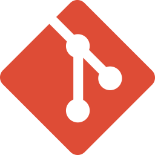

  

Hi  My name is Matasit Sanvaree
===========================================================================================================================================

### Full-Stack Developer  

* 🌍  I'm based in Suphan Buri
* 🖥️  See my portfolio at [Matasit](https://matasit.netlify.app/)
* ✉️  You can contact me at [friendzzaa09@gmail.com](friendzzaa09@gmail.com)
-------------------
# </ Skills >
### Front-End

&nbsp;&nbsp;
&nbsp;&nbsp;
&nbsp;&nbsp;

&nbsp;&nbsp;
&nbsp;&nbsp;

### Back-End

&nbsp;&nbsp;

### Database

&nbsp;&nbsp;

### Dev Tools

&nbsp;&nbsp;
&nbsp;&nbsp;
&nbsp;&nbsp;
&nbsp;&nbsp;

### Design Tools

&nbsp;&nbsp;

### Cloud Platform 

&nbsp;&nbsp;
&nbsp;&nbsp;

